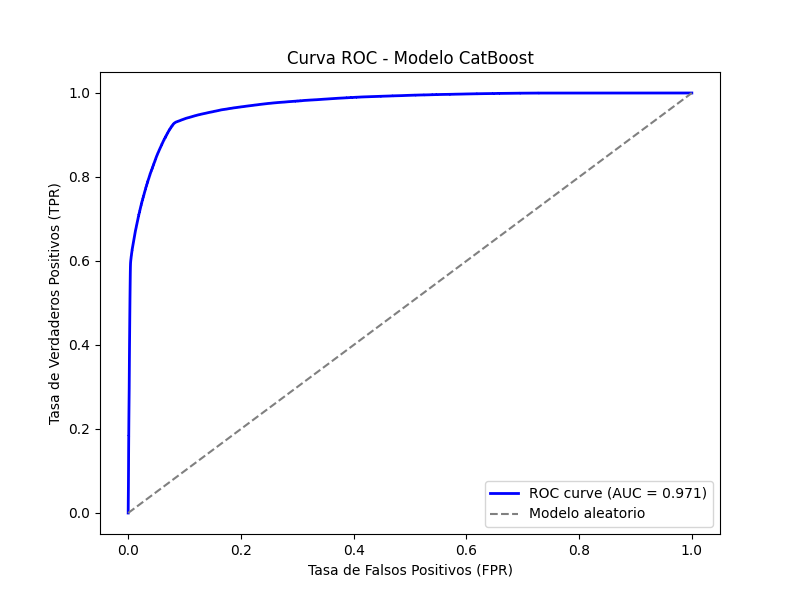

**Notebook_flight_on_time.ipynb**
# ✈️ FlightOnTime API

## 📌 Descripción
FlightOnTime es una aplicación que permite **predecir retrasos de vuelos** a partir de datos como aerolínea, origen, destino, fecha de partida y distancia.

El proyecto combina:

- **Backend en Spring Boot** para exponer endpoints REST y formularios web con Thymeleaf.  
- **Modelo de Machine Learning en Python (CatBoostClassifier)** entrenado con datos históricos de vuelos.  
- **Integración entre ambos componentes:** el backend en Java consume el modelo entrenado en Python para predecir retrasos graves y exponer resultados vía API.

---

## 🛠️ Tecnologías utilizadas
- **Java 17** + **Spring Boot 3.3.1**
- **Thymeleaf** para vistas HTML
- **Maven** para gestión de dependencias
- **Python 3.x** + **scikit-learn**, **pandas**, **numpy**, **catboost**
- **Joblib** para exportar el modelo entrenado
- **Git LFS** para manejar datasets grandes

---

## 📂 Estructura del proyecto
````
Prediccion-de-Retrasos-de-Vuelos/
├── be/                          # Backend en Spring Boot
│   ├── pom.xml                  # Configuración de Maven
│   ├── src/
│   │   ├── main/
│   │   │   ├── java/com/flightontime/
│   │   │   │   ├── controller/
│   │   │   │   │   ├── RootController.java
│   │   │   │   │   ├── PredictController.java
│   │   │   │   │   ├── StatsController.java
│   │   │   │   │   └── WebController.java
│   │   │   │   ├── dto/
│   │   │   │   │   ├── FlightInput.java
│   │   │   │   │   └── PredictionOutput.java
│   │   │   │   ├── exception/
│   │   │   │   │   └── GlobalExceptionHandler.java
│   │   │   │   ├── service/
│   │   │   │   │   └── DsClient.java
│   │   │   │   └── FlightOnTimeApplication.java
│   │   │   └── resources/
│   │   │       ├── application.yml
│   │   │       └── templates/
│   │   │           ├── form.html
│   │   │           └── result.html
│   └── target/
│       ├── classes/
│       │   ├── application.yml
│       │   ├── com/flightontime/
│       │   │   ├── controller/
|       |   |   |   |__ ApiRootController.class
|       |   |   |   |__ RootController.class
│       │   │   │   ├── PredictController.class
│       │   │   │   ├── StatsController.class
│       │   │   │   └── WebController.class
│       │   │   ├── dto/
│       │   │   │   ├── FlightInput.class
│       │   │   │   └── PredictionOutput.class
│       │   │   ├── exception/
│       │   │   │   └── GlobalExceptionHandler.class
│       │   │   ├── service/
│       │   │   │   └── DsClient.class
│       │   │   └── FlightOnTimeApplication.class
│       │   └── templates/
│       │       ├── form.html
│       │       └── result.html
│       ├── generated-sources/
│       │   └── annotations/
│       └── maven-status/
│           └── maven-compiler-plugin/
│               └── compile/
│                   └── default-compile/
│                       ├── createdFiles.lst
│                       └── inputFiles.lst
├── ds/                          # Data Science / Machine Learning
│   ├── app/
│   │   ├── dashboard.py
│   │   └── main.py
│   ├── data/
│   │   └── flight_clean.csv
│   ├── model/
│   │   └── cat_model.joblib
|   |   └── catoost_learning_curve.png
│   ├── notebooks/
|   |   └── notebook_flight_on_time.ipynb
|   |__ scripts/
|   |   └── entrenar.py
|   |   └── test_model.py
|   |__ service
|   |    └── init.py
|   |    └── predictor_service.py 
|   |__ venv310/
|   |__ init.py
|   |__ modelos_retraso.py
│   └── requirements.txt
├── README.md                    # Documentación del proyecto
└── .gitignore                   # Archivos ignorados por Git
````
---
## 🔎 Explicación:
- be/ → Todo el backend en Spring Boot (controladores, DTOs, vistas Thymeleaf, configuración).
- ds/ → Todo lo relacionado con el modelo de ML (dataset, notebooks, scripts, modelo exportado).
- templates/ → Vistas HTML (form.html y result.html).
- model/ → Carpeta donde se guarda el modelo entrenado (flight_delay_model.joblib).
- README.md → Guía de uso y documentación del proyecto.
  
**⚙️ Backend Java (Spring Boot)**
El backend web maneja el formulario y las vistas con Thymeleaf. Corre en:
👉 http://localhost:8080

---
# 🚀 Pasos para habilitar el entorno y ejecutar el BackEnd

**1. Clonar el repositorio:**
   
   ```bash
   git clone <URL-del-repo>
   cd BackEnd/Prediccion-de-Retrasos-de-Vuelos/be
   ````
---
**2. Ingresar a la carpeta del backend**

```Bash
cd ~/User/BackEnd/Prediccion\ de\ Retrasos\ de\ Vuelos/be
````
---
**3. Requisitos previos**

- Java JDK 8+ (ideal JDK 17 si trabajas con Spring Boot 3.x).
- Configura la variable de entorno JAVA_HOME apuntando al directorio de tu JDK.
- Verificar con:
  
```Bash  
java -version
````
---
**4. Instalación de mvnd (Maven Daemon)**

   
|            Método                |                                     Comando / Acción                             |               Notas                           |
|----------------------------------|----------------------------------------------------------------------------------|-----------------------------------------------|
| SDKMAN! (Linux/Mac)              | sdk install mvnd                                                                 | Instala automáticamente y gestiona versiones. | 
| Homebrew (Mac)                   | brew install mvnd                                                                | Rápido si ya usas Homebrew.                   | 
| Manual (Windows/Linux/Mac)       | Descargar el binario desde: https://maven.apache.org/download.cgi ó GitHub mvnd README, descomprime y agrega bin al PATH | Útil si no usas gestores de paquetes.         |
                                                                                                                                                   
Configurar variables de entorno
**- Windows (PowerShell):**
  
```Bash   
setx PATH "%PATH%;C:\Program Files\mvnd\bin"
````
**- Linux/Mac (bash/zsh):**

```Bash 
export PATH=$PATH:/opt/mvnd/bin
````

Verificar instalación

```Bash 
mvnd -v
````

**Deberías ver la versión de mvnd y la de Maven que utiliza.**

---
**5. Archivos clave de mvnd**

- mvnd / mvnd.cmd → ejecutables para Linux/Mac y Windows.
  .
- bin/ → carpeta con los binarios.
  
- conf/ → configuración interna.
  
- pom.xml → tu proyecto Maven, necesario para compilar.

**⚠️ Consideraciones**

- mvnd acelera las compilaciones usando un daemon (similar a Gradle).
  
- Si el proyecto no tiene pom.xml, mvnd no funcionará.
  
- Solo debes usarlo en proyectos Java/Maven (como en la carpeta be).
---
**6. Compilar y correr el servicio:**
Con mvnd ya instalado, ejecuta:

```Bash 
mvnd clean
mvnd compile
mvnd spring-boot:run
````
---
**7. El servidor se levanta en:**

http://localhost:8080

---
**8. Notas adicionales**

- Los datasets grandes están versionados con Git LFS.
Asegúrate de ejecutar:

````Bash
git lfs install
git lfs pull
````

 - Esta parte del README da una guía para entrenar el modelo, correr el backend y usar tanto la API REST como el formulario web.  

---
---
# ✈️ Predicción de Retrasos de Vuelos con CatBoost

## 📌 Descripción

Este proyecto implementa un modelo de Machine Learning para predecir retrasos graves de vuelos (≥ 30 minutos).
Se utiliza CatBoostClassifier junto con ingeniería de variables de fecha, hora y características del vuelo.
El microservicio se expone vía FastAPI en http://localhost:5000.

---
## 🚀 Cómo ejecutar el proyecto

**1. Clonar el repositorio:**
   
   ```bash
   git clone <URL-del-repo>
   cd BackEnd/Prediccion-de-Retrasos-de-Vuelos/ds
   ````
---
**2. Ingresar a la carpeta del microservicio** 

```Bash
cd ~/User/BackEnd/Prediccion\ de\ Retrasos\ de\ Vuelos/ds
````
---
**3. Crear y activar entorno virtual**

```Bash
python3.10 -m venv venv310
source venv310/Scripts/activate   # en Git Bash o PowerShell
````
---
**4. Instalar dependencias**

```Bash
python -m pip install -r requirements.txt
````
- **pip install** instala librerías de Python.
- El parámetro **-r requirements.txt** le dice a pip que lea el archivo requirements.txt, donde están listadas todas las dependencias necesarias para el proyecto.
  
📑 Dependencias principales:
  
    - fastapi==0.115.2            → Framework web moderno y rápido para crear APIs en Python
    - uvicorn[standard]==0.30.0   → Servidor ASGI ligero que ejecuta aplicaciones FastAPI
    - pandas==2.2.2               → Librería para manejo y análisis de datos tabulares (DataFrames)
    - scikit-learn==1.3.2         → Conjunto de algoritmos clásicos de machine learning y utilidades
    - joblib==1.3.2               → Herramienta para guardar y cargar modelos entrenados (serialización)
    - catboost==1.2.5             → Algoritmo de gradient boosting optimizado para variables categóricas
    - xgboost                     → Gradient boosting adicional

      
Verificar instalación

```Bash
python -m pip list
````
---
**5. Entrenar el modelo:**
Ejecuta el script de entrenamiento desde la raíz del proyecto: 

```Bash
cd ~/User/BackEnd/Prediccion\ de\ Retrasos\ de\ Vuelos
python -m ds.scripts.entrenar
````
Esto:

Carga ds/data/flight_clean.csv

Entrena modelos XGBoost y CatBoost

Guarda resultados en ds/model/

Genera curva de aprendizaje en ds/model/catboost_learning_curve.png

---
**6. Probar el modelo**

```Bash
python -m ds.scripts.test_model
````
Esto:

Carga ds/model/cat_model.joblib

Ejecuta una predicción de ejemplo

Imprime probabilidad y clasificación (Retrasado/Puntual)

---
**7. Ejecutar el script de entrenamiento**

```Bash
cd ~/User/BackEnd/Prediccion\ de\ Retrasos\ de\ Vuelos/ds
 python modelos_retraso.py
````
---
**8. El modelo entrenado se guarda en:**

```bash
ds/model/cat_model.joblib
````
---
**9. Levantar API con FastAPI:**

```Bash
python -m uvicorn ds.service.predictor_service:app --reload --host 0.0.0.0 --port 5000
```

**El servidor se levanta en:**
El servidor estará disponible en:

**- Swagger UI:** http://127.0.0.1:5000/docs 

**- Endpoint principal:** http://127.0.0.1:5000/predict

---
**📑 Endpoints**: 

**REST API**
**- POST /predict**
**Recibe un JSON con los datos del vuelo y devuelve la predicción.**

**Ejemplo de request:**

````json
{
  "aerolinea": "AA",
  "origen": "DFW",
  "destino": "STL",
  "fecha_partida": "2026-06-15T4:50:00",
  "distancia_km": 885
}
````
**Ejemplo de respuesta:**

````json
{
  "prevision": "Retrasado",
  "probabilidad": 0.805,
  "features": {
    "aerolinea": "AA",
    "origen": "DFW",
    "destino": "STL",
    "distancia_km": 885,
    "dia_semana": 15
  }
}
````
**Interfaz Web**

- GET /form → muestra formulario HTML.
- POST /form → procesa datos y muestra resultado en result.html.
---
**📊 Modelo de Machine Learning**
**- Features utilizadas:**

  > - Aerolínea
  > - Origen
  > - Destino
  > - Hora de partida
  > - Día de la semana
  > - Distancia (km)

**- Target:** `RETRASO_GRAVE`  
(0 = vuelo puntual, 1 = retraso grave ≥ 30 minutos)

**- Algoritmo:** CatBoostClassifier  
Maneja variables categóricas de forma nativa (`cat_features`), sin necesidad de OneHotEncoder.

**- Métricas de evaluación:**  
- Accuracy  
- Precision  
- Recall  
- F1-score  
- ROC-AUC (para medir capacidad de discriminación global)

---
## 📡 Ejemplo de petición y respuesta

**Entrada (features de un vuelo):**

```
{
  "AEROLINEA": "AA",
  "AEROPUERTO_ORIGEN": "DFW",
  "AEROPUERTO_DESTINO": "STL",
  "DISTANCIA": 885,
  "DIA_SEMANA": 15,
  "MES_PARTIDA": 6,
  "ES_FIN_DE_SEMANA": 0,
  "TEMPORADA": "Invierno",
  "HORA_LLEGADA": 4:00,
  "FRANJA_HORARIA_LLEGADA": "Madrugada",
  "LLEGADA_PROGRAMA": 3:30,
  "FRANJA_LLEGADA_PROGRAMA": "Madrugada"
}
 ````
**Salida (predicción del modelo):**

```
{
  "prevision": "Retrasado",
  "probabilidad": 0.805
}
````

**📊 Resultados del modelo- Umbral fijo: 0.7912**
- Precisión: 0.76
- Recall: 0.77
- F1-score: 0.76
- ROC-AUC: 0.97

 **Curva ROC-AUC**  
 


**Matriz de confusión**

```bash
[[1002183   31512]
 [  29915  100206]]
````


--- 
## 📂 Dataset utilizado

Se emplea el dataset de vuelos históricos de EE.UU. (2015), disponible en el repositorio del Bureau of Transportation Statistics (BTS):

👉 On-Time Performance Dataset (transtats.bts.gov in Bing)

Variables principales:

- Aerolínea
- Aeropuerto origen/destino
- Fecha y hora de partida/llegada
- Retrasos por causa (clima, aerolínea, sistema aéreo, seguridad, avión tardío)


**📡 Ejemplo de consumo**

## Curl 
Abrir otro Bash:

```Bash
cd ~/User/BackEnd/Prediccion\ de\ Retrasos\ de\ Vuelos
curl -X POST "http://127.0.0.1:5000/predict" \
     -H "Content-Type: application/json" \
     -d '{"aerolinea":"AA","origen":"DFW","destino":"STL","fecha_partida":"2026-06-15T4:50:00","distancia_km":885}'
````
Respuesta:
{"prevision":"Retrasado","probabilidad":0.805}

**- Postman/Insomnia:** crear una request POST con el mismo JSON.
**- Backend Java (Spring Boot):** El controlador enviará el POST y recibirá el JSON para mostrarlo en **result.html**.
  
- http://127.0.0.1:5000/predict → solo responde a POST con JSON, no a GET en navegador.

  ## 🤝 Contribución

¡Gracias por tu interés en contribuir! Para mantener un flujo de trabajo ordenado:


1. Haz un **fork** de este repositorio.

2. Crea una rama descriptiva para tu aporte:
     
   ```bash
   git checkout -b feature/nueva-funcionalidad
   ```
3. Realiza tus cambios y haz commit con mensajes claros:
    
    ```bash
   git commit -m "Agrega validación de retrasos graves en API"
   ````
4. Haz push a tu rama:
   
   ```bash
   git push origin feature/nueva-funcionalidad
   ````
5. Abre un Pull Request explicando:
   
    - Qué problema resuelve.
    - Qué cambios introduces.
    - Cómo probarlos.

 
**📜 Licencia**

Este proyecto se distribuye bajo la licencia MIT.
